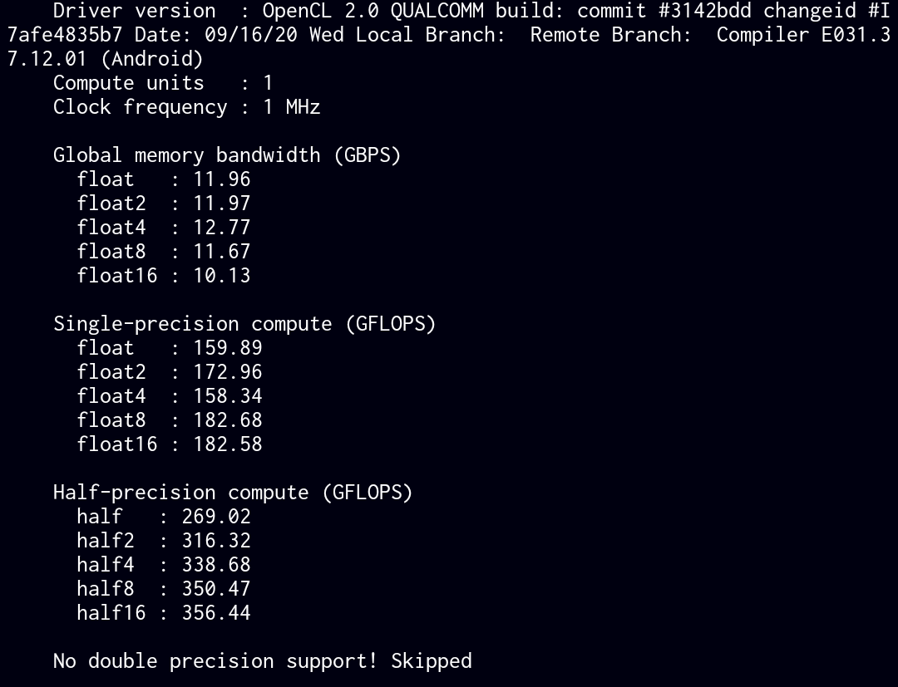

# termux-helpers
A collection of scripts to assist in and patch certain component installations within Termux on the Android platform

## Patches and Helpers
- (install-opencl): Install OpenCL utilities and apply patches whether the ocl-icd doesn't have any platform available. The patcher will override the ocl-icd OpenCL library installation with the system vendor library! If your custom ROM was updated the opencl library should be reinstalled issuing an ```remove-opencl``` and after ```install-opencl```




